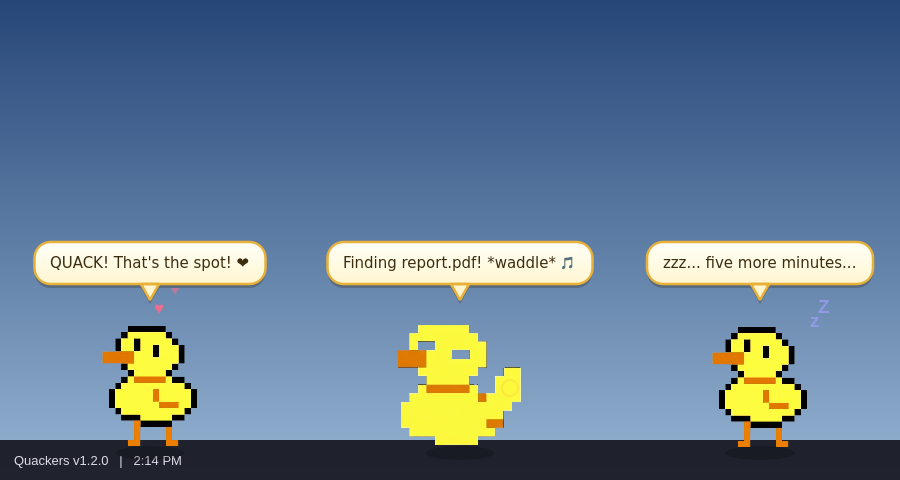
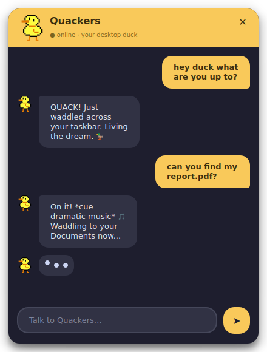

# Duck That Carries You Over A Disproportionately Small Gap 🦆

A transparent, pixel-art **duck desktop pet** powered by Google Gemini. It waddles
around your screen with no window border, sleeps when you're idle, peeks at what
you're doing, chats with you, and hunts down files (with theme music).



<p align="center"></p>

---

## ▶️ What to run

### Easiest: download a prebuilt app (no Python needed)

Grab the latest build from the [**Releases page**](../../releases/latest):

| Platform | File | How to run |
|----------|------|-----------|
| **Windows** | `duck-pet-windows.zip` | Unzip, then double-click **`duck that carries you over a disproportionately small gap.exe`** |
| **macOS** | `duck that carries you over a disproportionately small gap.dmg` | Open the `.dmg`, drag the app to **Applications**, then launch it |

> **macOS first launch:** it's not notarized, so right-click the app → **Open** (or
> System Settings → Privacy & Security → **Open Anyway**). Grant **Screen Recording**
> permission so the duck can see your screen.

On first launch you'll be asked for a free **Gemini API key** — get one at
[aistudio.google.com](https://aistudio.google.com). (You can skip it and the duck
still walks around, just without AI chat.)

### Or run from source

```bash
pip install -r requirements.txt
python src/main.py
```

### Or build it yourself

```bash
# Windows  (run on Windows)
build_windows.bat

# macOS    (run on macOS)
chmod +x build.sh && ./build.sh
```

The finished app lands in `dist/`.

---

## ✨ Features

- **Transparent** — the duck floats directly on your desktop, no window frame.
- **Wanders** around the screen and bounces off the edges.
- **Sleeps** with floating Z's after ~5 min idle; click to wake it.
- **AI chat** — click the duck to open a chat window (powered by Gemini).
- **Sees your screen** — every so often it screenshots your desktop and makes a
  funny comment about what you're doing.
- **Pet the duck** ❤️ — double-click it (or right-click → Pet the duck) for
  floating hearts and affectionate quacking.
- **Finds files** — tell it *"find me a file called report.pdf"* (or just
  *"report"* — no extension needed) and it:
  1. waddles in place,
  2. **starts playing the theme music** 🎵 (the
     [YouTube clip](https://youtu.be/lV28xl-YKw4) — it auto-plays in your browser,
     or through the app if you have `yt-dlp` installed),
  3. searches your Desktop / Documents / Downloads / Home,
  4. opens **Finder / File Explorer** right at the file.

## 🎮 Controls

| Action | Effect |
|--------|--------|
| **Left-click** the duck | Open chat |
| **Double-click** the duck | Pet it ❤️ |
| **Right-click** the duck | Context menu (chat, find file, peek, pet, settings, quit) |
| **Drag** the duck | Move it anywhere |
| **System tray** icon | Same menu; double-click to chat |

## 🗂 Project layout

```
src/
  main.py          entry point + config storage
  pet.py           the duck: transparent overlay, animation & behavior
  gemini.py        Gemini client (chat + screen-vision)
  bubble.py        speech bubbles
  chat_dialog.py   chat window
  setup_dialog.py  API-key setup
  audio.py         theme-music player (yt-dlp / browser autoplay)
  file_ops.py      file search + Finder/Explorer opener
assets/            duck sprites (idle, wave, 4-frame walk cycle)
.github/workflows/release.yml   builds Windows + macOS apps on every git tag
```

## 🚀 Cutting a release

Push a version tag and GitHub Actions builds both apps and publishes a Release
automatically:

```bash
git tag v1.0.0
git push origin v1.0.0
```
